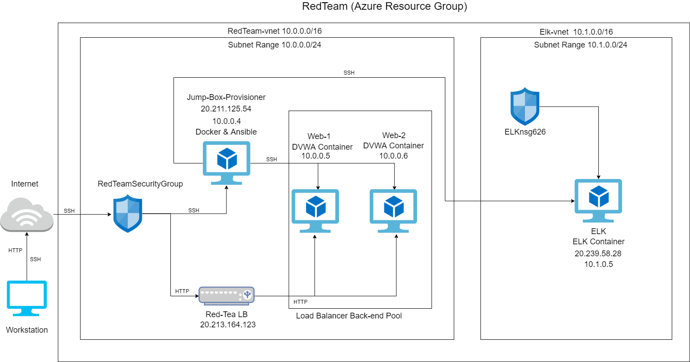
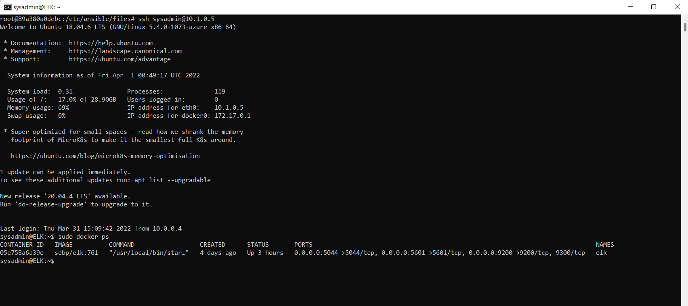

## Automated ELK Stack Deployment

The files in this repository were used to configure the network depicted below.

These files have been tested and used to generate a live ELK deployment on Azure. They can be used to either recreate the entire deployment pictured above. Alternatively, select portions of the _____ file may be used to install only certain pieces of it, such as Filebeat.

  - [install-elk.yml](https://github.com/UshanyK/ELK_Stack_Deployment/blob/main/Ansible/install-elk.yml)
  - [filebeat-playbook.yml](https://github.com/UshanyK/ELK_Stack_Deployment/blob/main/Ansible/filebeat-playbook.yml)
  - [install-metricbeat.yml](https://github.com/UshanyK/ELK_Stack_Deployment/blob/main/Ansible/Metricbeat-Playbook.yml)

This document contains the following details:
- Description of the Topology
- Access Policies
- ELK Configuration
  - Beats in Use
  - Machines Being Monitored
- How to Use the Ansible Build

### Description of the Topology

The main purpose of this network is to expose a load-balanced and monitored instance of DVWA, the D*mn Vulnerable Web Application.

Load balancing ensures that the application will be highly availability, in addition to restricting DDoS attacks to the network.
- Load balancers aim to prevent the availability of the CIA Triad by protecting against DDoS attacks.
- The jump box sits between the public internet and other machines that are not exposed to the internet. Through a process called fanning in, the jump box monitors and secures against any IP address that have not been whitelisted and attempting to access the other machines. Routing logic is implemented to the jump box which allows for monitoring connections between fewer machines than all of the machines in a given network.

Integrating an ELK server allows users to easily monitor the vulnerable VMs for changes to the metric and system logs.
- Filebeat watches for log data from different modules. In this network, Filebeat monitors system logs.
- Metricbeat records metrics collected from the operating system or services on a given server.

The configuration details of each machine may be found below.
_Note: Use the [Markdown Table Generator](http://www.tablesgenerator.com/markdown_tables) to add/remove values from the table_.

| Name                 | Function      | IP Address                              | Operating System			 |
|----------------------|---------------|-----------------------------------------|---------------------------------|
| Jump-Box-Provisioner | Gateway       | 10.0.0.4(Private)  | Linux (ubuntu 18.04)            |
| Web-1                | Webserver     | 10.0.0.5(Private)                       | Linux (ubuntu 18.04)            |
| Web-2                | Webserver     | 10.0.0.6(Private)                       | Linux (ubuntu 18.04)            |
| ELK                  | Kibana        | 10.1.0.5(Private) 	  | Linux (ubuntu 18.04)            |
| RedTea-LB            | Load Balancer | 21.213.164.123(Public)                  |              		       |

### Access Policies

The machines on the internal network are not exposed to the public Internet. 

Only the Jump-Box-Provisioner machine can accept connections from the Internet. Access to this machine is only allowed from the following IP addresses:
- my personal IP address
- 10.0.0.5
- 10.0.0.6
- 10.1.0.4

Machines within the network can only be accessed by Jump-Box-Provisioner.
- The ELK VM is accessible through the Jump-Box-Provisioner. The Jump-Box-Provisioner had a public IP address of 20.211.125.54 and a private IP address of 10.0.0.4

A summary of the access policies in place can be found in the table below.

| Name                 | Publicly Accessible | Allowed IP Addresses       |
|----------------------|---------------------|----------------------------|
| Jump-Box-Provisioner | Yes                 | 10.0.0.5 10.0.0.6 10.1.0.5 |
| Web-1                | No                  | 10.0.0.4                   |
| Web-2                | No                  | 10.0.0.4                   |
| ELK                  | Yes                 | 10.0.0.4 MyIPAddress       |

### Elk Configuration

Ansible was used to automate configuration of the ELK machine. No configuration was performed manually, which is advantageous because...
- Ansible allows for the configuration of multiple machines at the same time. This both saves time from configuring each of the machines and limits the errors that may take place during the configuration.

The playbook implements the following tasks:
- Install docker.io and python3-pip using the apt module
- Install docker using pip module
- Allow ELK VM to use more memory by increasing its memory map to 262144 using the command module
- Install seb/elk:761 container using the docker_container module
- Enable docker service up on boot using the systemd module

The following screenshot displays the result of running `docker ps` after successfully configuring the ELK instance.

### Target Machines & Beats
This ELK server is configured to monitor the following machines:
- 10.0.0.5 (Web-1)
- 10.0.0.6 (Web-2)

We have installed the following Beats on these machines:
- Filebeat system module
- Metricbeat docker metrics

These Beats allow us to collect the following information from each machine:
- Metricbeat docker metrics: This beats collects metrics from the docker container on each of the VMs. The default metrics recorded include conatiner, cpu, diskio, healthcheck, info, memory, network and many other metrics. E.g. the docker container metrics collects IP addresses for all the containers.
- Filebeat system module: This beats monitors and collects information on any changes made to any system logs. This includes syslog files, authorization log files, and events from sudo, useradd and groupadd commands. E.g. in the authorization log file, filebeat will collect information on any SSH events found.

### Using the Playbook
In order to use the playbook, you will need to have an Ansible control node already configured. Assuming you have such a control node provisioned: 

SSH into the control node and follow the steps below:
ELK
- Update the /etc/ansible/files/install-elk.yml file to include "hosts:elk" in order to run the playbook on the VM (ELK) where the ELK server will be installed 
- Run the playbook, and ssh to sysadmin@10.1.0.5 and run sudo docker ps to check that the installation worked as expected.

Filebeat
- Update the /etc/ansible/files/filebeat-config.yml file to include "host: "10.1.0.5:5601"" under Kibana (Line 1805) and "hosts: ["10.1.0.5:9200"]" under Elasticsearch output (Line 1105)
- Copy the /etc/ansible/files/filebeat-config.yml file to /etc/filebeat/filebeat.yml
- Update the /etc/ansible/roles/install-filebeat.yml file to include "hosts:webservers" in order to run the playbook on the VM's (Web-1 and Web-2) that are to be monitored by ELK 
- Run the playbook, and navigate to http://20.239.58.28:5601/app/kibana to check that the installation worked as expected.

Metricbeat
- Update the /etc/ansible/files/metricbeat-config.yml file to include 10.1.0.5 (ELK server IP) in Elastic and Kibana
- Copy the /etc/ansible/files/metricbeat-config.yml file to /etc/metricbeat/metricbeat.yml
- Update the /etc/ansible/roles/install-metricbeat.yml file to include "hosts:webservers" in order to run the playbook on the VM's (Web-1 and Web-2) that are to be monitored by ELK 
- Run the playbook, and navigate to http://20.239.58.28:5601/app/kibana to check that the installation worked as expected.

_As a **Bonus**, provide the specific commands the user will need to run to download the playbook, update the files, etc._